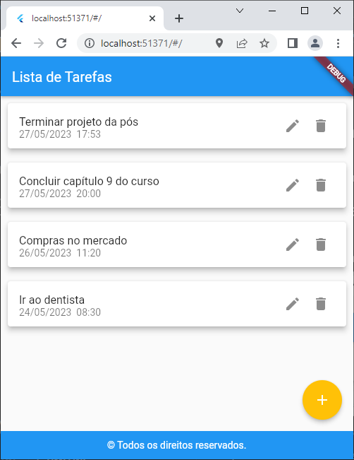
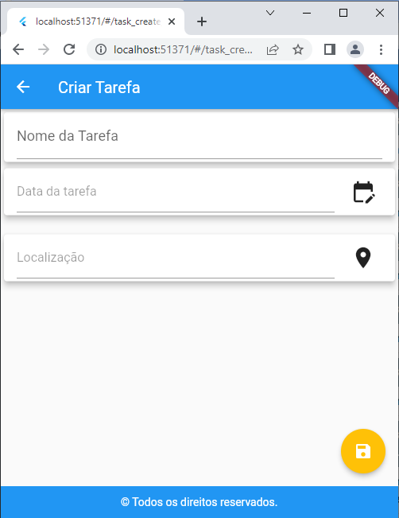
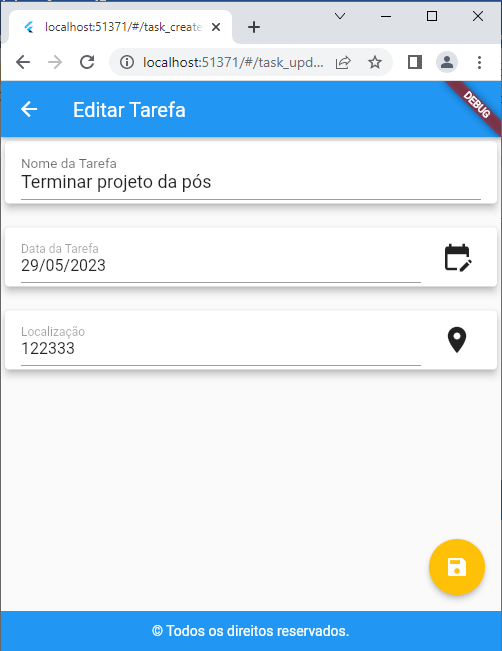
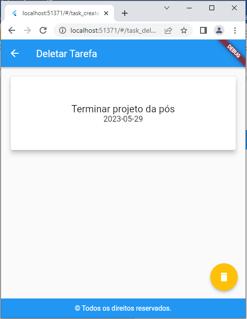

# Lista de compras

## Projeto de conclusão da displina Desenvolvimento Mobile com Flutter da Pós.

Essa é uma aplicação para gerenciamento de uma lista de tarefas.
As telas possuem gerenciamento de estado e as tarefas são armazenadas em memória. 

## Funcionalidades
 

### Listagem de Tarefas

<!-- {width=50%} -->

Nesta tela, é possível visualizar a lista de tarefas cadastradas.
 

### Criação de Tarefa

<!--  -->

Nesta tela, é possível criar uma nova tarefa, preenchendo os campos necessários.
Faz a verificação se todos os campos foram preenchidos.
 

### Edição de Tarefa

<!--  -->

Nesta tela, é possível editar uma tarefa existente, modificando seus dados (nome, data, hora e localização).
 

### Exclusão de Tarefa

<!--  -->

Nesta tela, é possível excluir uma tarefa existente, confirmando a exclusão.

